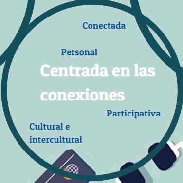

# Conexiones

Ilustración 1.3 Esta imagen se ha adaptado de una similar perteneciente al libro _Digital Literacies_. Cita: Dudeney, G., N. Hockly, y M. Pegrum. (2013). _Digital Literacies._ Harlow: Pearson.

En la imagen, algunas de las palabras asociadas al área de las conexiones son "personal", "participativo", "red", "cultural" e "intercultural". Muchos alumnos se conectan para conseguir tantos seguidores como sea posible pero esta forma de entender las conexiones con otros en las redes sociales es peligrosa. Con quién nos conectamos determina a qué información, noticias, medios, ideas políticas y publicidad nos exponemos a diario. Los individuos con los que conectamos conforman nuestra red personal de aprendizaje (PLN), que está formada por las personas con las que el alumno interactúa y de las que extrae conocimiento en un entorno digital, llamado "[entorno personal de aprendizaje](https://es.wikipedia.org/wiki/Entorno_personal_de_aprendizaje)" (PLE). Parte importante de este concepto es la teoría del [conectivismo](https://es.wikipedia.org/wiki/Conectivismo) desarrollada por [George Siemens](https://es.wikipedia.org/wiki/George_Siemens) y [Stephen Downes](https://es.wikipedia.org/wiki/Stephen_Downes): los alumnos crean conexiones y desarrollan una red que contribuye a su aprendizaje y desarrollo profesional. A continuación ofrecemos un extracto del libro de Dryden y Vos sobre las redes de aprendizaje:

_"Por primera vez en la historia, ahora sabemos cómo almacenar prácticamente toda la información más importante de la humanidad y hacerla accesible, casi de forma instantánea, en casi cualquier formato, para la mayoría de las personas de la Tierra. También sabemos cómo hacerlo de formas genialmente novedosas para que la gente pueda interactuar y aprender de ello." _  

Podemos ayudar a nuestros alumnos a conectarse con expertos en una materia (SMEs), autores y mentores que les apoyen en sus intereses y alimenten sus pasiones.

