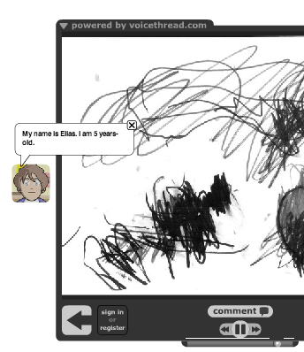

# Creación de nuestras identidades digitales: los avatares

Una forma de proteger a nuestro alumnado en la red es hacer que creen avatares, representaciones gráficas de sí mismos. Esta actividad no solo anima a los alumnos a desarrollar su identidad digital sino también a reflexionar sobre ella y sobre su huella digital. Por ejemplo, un profesor de Salud pidió a sus alumnos adolescentes que crearan avatares y luego reflexionaran sobre cómo habían manipulado su apariencia física en ellos; los jóvenes vieron que habían hecho a su yo digital más delgado, con diferente color de pelo, etc. (Boss, 2009)

Además, en muchos videojuegos el primer paso consiste en crear un avatar, así que los alumnos lo reconocerán como una forma de unirse a una comunidad digital y comenzar su viaje, un indicador de que participarán en una exploración digital. Según Taylor (2010), _"Los alumnos también crean sus propios avatares que "se llevan" con ellos mientras exploran páginas web o juegos de realidad virtual en la red. Estos avatares les permiten cruzar el portal hacia el mundo de la red de forma que puedan obtener experiencia de primera mano en lugar de escuchar una conferencia de forma pasiva."_

Otro beneficio está en que el alumnado pueda experimentar su aprendizaje con avatares. Los lectores con dificultades no siempre visualizan lo que leen pero con un avatar pueden experimentar el aprendizaje de diversas formas que les ayuden a contextualizar el aprendizaje. Trans (2010) afirma _"cuando los alumnos utilizan sus avatares para explorar el mundo virtual, tienen acceso una gran cantidad de conocimiento. Cuando entran en un Imperio Romano, por ejemplo, los avatares pueden reconstruir famosos monumentos romanos como el Coliseo o el Panteón. Los alumnos pueden estudiar los detalles arquitectónicos, las características de las ropas o la cultura de las gentes romanas. Los profesores pueden variar instantáneamente las realidades virtuales cambiando del modo histórico al arqueológico y ahora los alumnos exploran Roma de nuevo, esta vez con diferentes objetivos de aprendizaje y resultados."_

Una forma en que los estudiantes pueden usar avatares para experimentar lo que aprenden es crear una _machinima_, o grabación de pantalla de sus aventuras o acciones en un mundo virtual, como [este creado por Shelly Terrell](https://vimeo.com/15915055) para explorar los diversos aspectos de una exhibición artística en Second Life (a continuación se presentan capturas de pantalla del avatar, Rainey, y de la _machinima_). Podemos usar herramientas como [Jing](http://www.techsmith.com/jing.html) o [Camtasia](http://www.techsmith.com/camtasia.html) para crear estas _machinimas_. 

Captura de la _machinima_ [Quadrapop Black Build in Second Life for Slanguages 2010](http://vimeo.com/15915055), por Shelly Sanchez Terrell

Captura de la _machinima_, [Quadrapop Black Build in Second Life for Slanguages 2010](http://vimeo.com/15915055), por Shelly Sanchez Terrell 

El profesorado puede hacer que su alumnado cree avatares que les representen en diversos proyectos digitales. Los alumnos de 4 a 6 años de Shelly Terrell crearon sus identidades digitales con [DoppelMe](http://www.doppelme.com/), dieron a sus avatares unos alias y realizaron un proyecto en que presentaron estos avatares al resto de la clase. También usaron sus DoppleMes en lugar de su imagen real cuando crearon [proyectos con Voicethread](https://voicethread.com/share/558117/), de forma que las familias veían que la identidad de los alumnos estaba protegida. 

 Captura del [proyecto de narración digital en Voicethread](https://voicethread.com/share/558117/): _The German, Turkey, and New Zealand Animal Story_

Hay muchas páginas gratuitas de creación de avatares para los alumnos, como los ejemplos que se ofrecen en la siguiente lista. Al decidir cuál utilizar, debemos pensar en la edad de nuestro alumnado y la finalidad de la creación del avatar. 

*   [Web Tools for Kids](https://sites.google.com/site/webtoolsbox/avatars)\- Clasifica los avatares en nueve categorías y proporciona ejemplos. 
*   [Galería Avatares en Symbaloo](https://formacionintef.symbaloo.com/mix/avatares3)-  Un webmix de creadores de avatares. Simplemente haced clic y os llevarán a la página deseada.

**Contar historias **

Se puede pedir a los alumnos que cuenten un hecho histórico o representen e ilustren un hecho de un texto, de forma que el avatar deberá representar un personaje o figura histórica. En este caso, se podrían utilizar herramientas como [GoAnimate](http://goanimate.com/), [Voki](http://www.voki.com/), o [Creaza](http://www.creazaeducation.com/), que tienen una galería de personajes famosos. 

En [este otro Symbaloo](https://formacionintef.symbaloo.com/mix/creaciondecomic1), podréis encontrar más herramientas de creación de cómics. 

Guardar