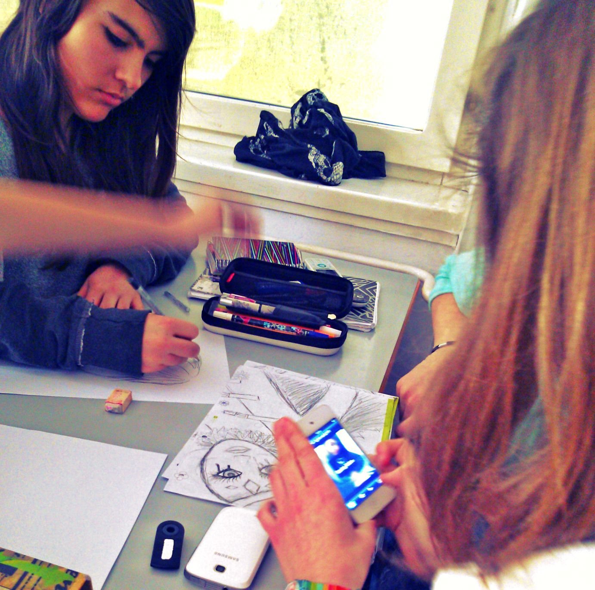
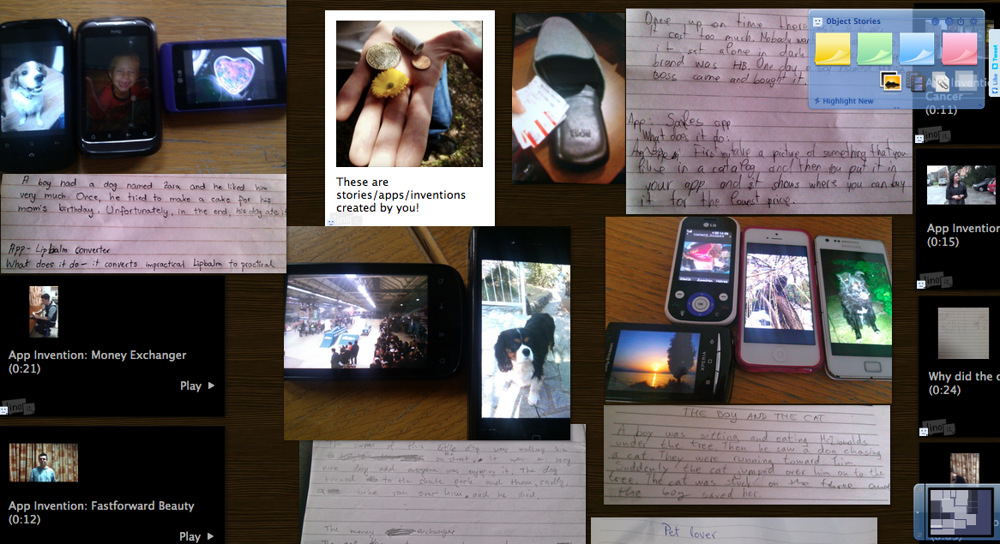

# Ejemplo 2. Publicidad en grupo en un proyecto con adolescentes

En 2013 [Shelly Terrell](http://www.shellyterrell.com/) viajó como instructora del profesorado a Croacia y Eslovenia, donde trabajó con varios grupos de adolescentes en la creación de historias digitales con sus dispositivos móviles. Los alumnos tenían 45 minutos para distribuirse en pequeños grupos, planear un comercial de 30 segundos, crear el comercial (utilizando dispositivos móviles y apps de edición de vídeo e imagen) y presentárselo a la clase. Era la primera vez que se les permitía utilizar sus móviles para aprender, pero la experiencia tuvo mucho éxito.

El alumnado se dividió en grupos de cuatro con esta misión:

_La compañía KLM se especializa en crear apps que hagan la vida más fácil a los adolescentes. Tu equipo es responsable de crear el prototipo de una app que resuelve un problema al que se enfrentan los jóvenes. Por ejemplo, podrías inventar una app que resuelva el problema del acoso. Mostrarás al equipo de dirección de KLM un videocomercial de esta nueva app mostrando sus posibilidades. El tiempo de emisión es caro, así que limitaremos la duración a un minuto o menos._  

Se les permitió hacer una lluvia de ideas, como en la imagen:

Imagen de los alumnos de Eslovenia haciendo una lluvia de ideas para realizar su comercial. Imagen de Shelly Sanchez Terrell, utilizada con permiso de la autora. Todos los derechos reservados.

Una de las profesoras, [Marijana Smolcec](http://twitter.com/mscro1), grabó la actividad en su escuela en Ogulin (Croacia) y creó [este vídeo](http://www.youtube.com/watch?list=PL2FF339B74F171CEA&v=gjqay1lEthA) que muestra el proceso de la lección:

*   Bienvenida  y presentación

*   Ciudadanía digital

*   División en grupos para la narración inicial con imágenes
*   Asignación de la misión grupal  
    
*   Presentación de un ejemplo de la tarea
*   División del alumnado en grupos con asignación de tareas
    
*   Guion gráfico y planteamiento  
    
*   Producción/edición de los anuncios

*   Presentación de los anuncios

 https://youtu.be/gjqay1lEthA 
        

Las historias de estos grupos de Eslovenia y Croacia se recopilaron en [LinoIt](http://linoit.com/users/shellterrell/canvases/0bject%20Stories) y [Padlet](http://padlet.com/wall/iaic5vzly6). Ambos son sitios gratuitos colaborativos que funcionan como un tablón de notas adhesivas. El docente puede iniciar el tablón y así permitir que el alumnado suba imágenes, vídeos, enlaces y comentarios a través de notas sin necesidad de registrarse a no ser que se haya seleccionado esa opción; simplemente se hace clic sobre el muro y se envía.

Captura de [las historias y comerciales en Lionit](http://linoit.com/users/shellterrell/canvases/0bject%20Stories) creada por Shelly Terrell. Utilizada con permiso de la autora. Todos los derechos reservados.  

Podéis ver otro ejemplo de narración cooperativa en [esta unidad para que el alumnado cree un mito cultural en grupos](http://alex.state.al.us/lesson_view.php?id=30065) donde se explica la evaluación, consejos de agrupamiento y objetivos entre otros elementos (en inglés). Dees, 2012.

